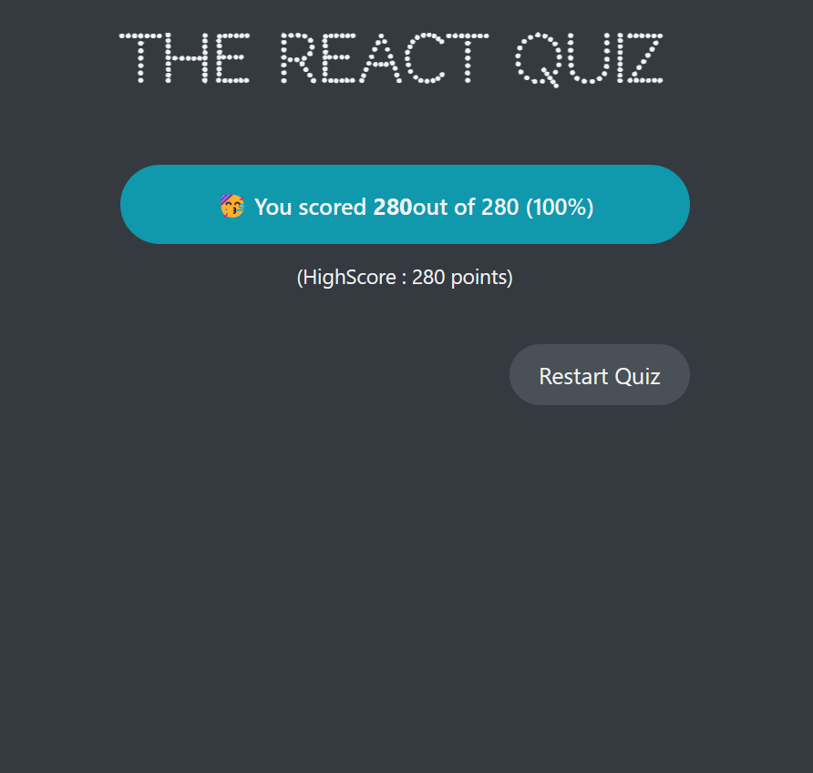

# REACT QUIZ APP - A PROJECT USING USEREDUCER HOOK


## PROJECT DESCRIPTION

- This project is a quiz app that uses the useReducer hook to manage state.
- The project is built using React and CSS.

## PROJECT FEATURES

- The project has the following features:
  - A start page that displays the quiz title and a button to start the quiz.
  - A quiz page that displays the question, the options, and a button to submit the answer.
  - A result page that displays the score and a button to restart the quiz.
  - A progress bar that displays the current question number and the total number of questions.
  - A score that displays the current score and the total number of questions.
  - A timer that displays the time left to answer the question.

## PROJECT SCREENSHOTS

- The following are the screenshots of the project:




## HOW TO RUN THE PROJECT

- Clone the project using the following command:

```bash
git clone https://github.com/kingmalitha/Quiz-App-With-useReducer.git
```

- Navigate to the project directory and install the dependencies using the following command:

```bash
npm install
```

- Run the project using the following command:

```bash
npm run dev
```

- The project will run on port 5173.

## FUTURE IMPROVEMENTS

- The project can be improved by adding the following features:
  - Several quizs related to different topics.
  - A feature where user can select the number of questions.
  - A feature to save the score to a database and retrieve.

## USEREDUCER HOOK

- useReducer is a hook that is used for state management. It is an alternative to useState.
- It is used mostly for complex state logic. It is similar to the reducer function used in JavaScript.
- It accepts a reducer function with the application initial state, returns the current application state, then dispatches a function.

```js
const [state, dispatch] = useReducer(reducer, initialState);
```

- state: current state of the application
- dispatch: function used to dispatch actions to change the state of the application
- reducer: pure function (no side effects!) that takes current state and action , and return the next state.
- action: object that describes how to update state

### HOW REDUCERS UPDATE STATE


### USESTATE VS USEREDUCER


### WHEN TO USE USEREDUCER

- Use the following flowchart to determine when to use useReducer


