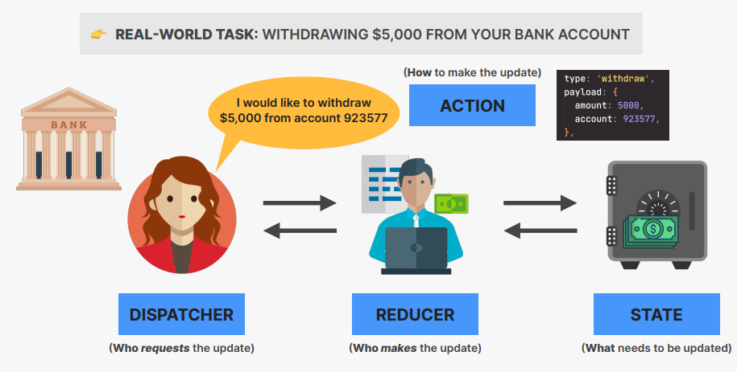

## useReducer Hook

- useReducer is a hook that is used for state management. It is an alternative to useState.
- It is used mostly for complex state logic. It is similar to the reducer function used in JavaScript.
- It accepts a reducer function with the application initial state, returns the current application state, then dispatches a function.

```js
const [state, dispatch] = useReducer(reducer, initialState);
```

- state: current state of the application
- dispatch: function used to dispatch actions to change the state of the application
- reducer: pure function (no side effects!) that takes current state and action , and return the next state.
- action: object that describes how to update state

### HOW REDUCERS UPDATE STATE



